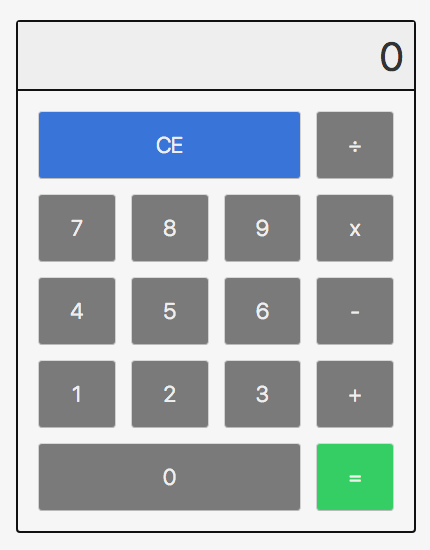

<p align="center"></p>

# Calculator JavaScript

[](./license.md)

This calculator I've done in the course [JavaScript Ninja](https://blog.da2k.com.br/curso-javascript-ninja/).
I've decided to use **CSS Grid** and **Webpack** to practice my skills with this tools.
Feel free to use the code or add more features.

[View project](https://calculator-javascript.netlify.com/)

# Install project

### Install dependencies
```
npm install
```
# Run project

### Build for DEV environment
```
npm run build-dev
```
### Build for PROD environment
```
npm run build-prod
```
### Run server
```
npm run server
```
### Run watch
```
npm run watch
```
# Todos

 - Write MORE Tests

# License

MIT License © João Paulo C. M. Fricks
